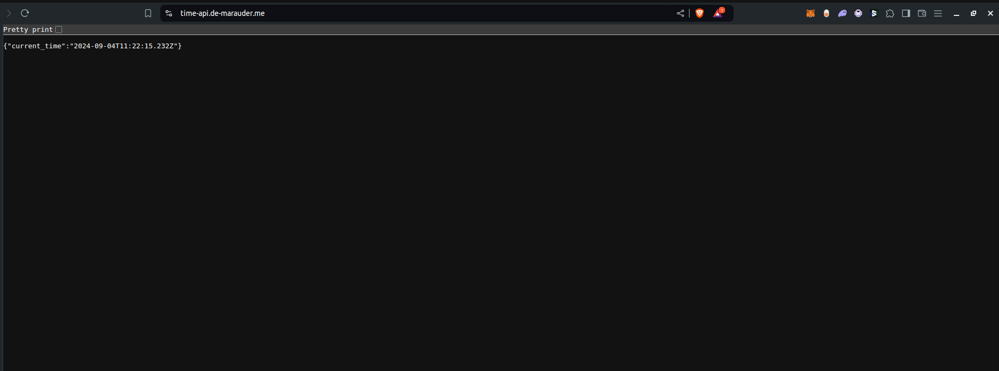

# Google Kubernetes Engine (GKE) setup using Terraform

This project demonstrates how to configure GKE with Terraform using best practices. It's contains CICD procedures for executing the terraform infrastructures using github actions.

## TODO:
1. API Development: 
   - [x] Develop a simple API (in the programming language of your choice) that returns the current time in a JSON format when accessed via a GET request.   
   - [x] Containerize the API using Docker. 
2. Infrastructure Setup and Deployment (Terraform): 
   - [x] Use Terraform to create the entire infrastructure on Google Cloud Platform (GCP).
   
   The infrastructure should include: 
      - [x] A Google Kubernetes Engine (GKE) cluster where the API will be deployed. 
      - [x] A NAT gateway to manage egress traffic from the cluster. 
      - [x] Appropriate IAM roles and policies. 
      - [x] VPC networking, subnets, and firewall rules for secure communication. 
      - [x] Kubernetes resources such as Namespaces, Deployments, Services, ConfigMaps, and Ingress. 
      - [x] Deploy the API to the GKE cluster exclusively using Terraform. This means you should define the Kubernetes resources (Deployments, Services, Ingress, etc.) within your Terraform code. 
      - [ ] Implement Terraform Policy as Code (PaC) to enforce at least one security policy (e.g., ensuring that certain ports are closed or specific IAM roles are not granted). 
3. CI/CD Pipeline: 
   - [x] Implement a GitHub Actions pipeline that: 
   - [x] Runs Terraform to provision all required infrastructure, including Kubernetes resources. 
   - [x] Builds the Docker image for the API. 
   - [x] Deploys the API to the GKE cluster as part of the Terraform deployment.
   - [x] Verifies that the API is accessible by running a test that hits the API endpoint and checks the response. 
4. Network Security: 
   - [x] Set up a NAT gateway in GCP to manage the outbound traffic for your GKE cluster. 
   - [x] Implement any additional firewall rules to secure your infrastructure.   
   - [x] Ensure that your Terraform configuration includes security best practices, such as restricting access to sensitive resources. 
5. Extras:
   - [x] Implement monitoring and alerting for the deployed API using Google Cloud's monitoring tools. 
   - [x] Use advanced Terraform features to organize your code. 

## [How to run](./terraform/README.md)

Requirements
- Terraform
- Gcloud
  
Please vist [here](./terraform/README.md) for more information

## Result
